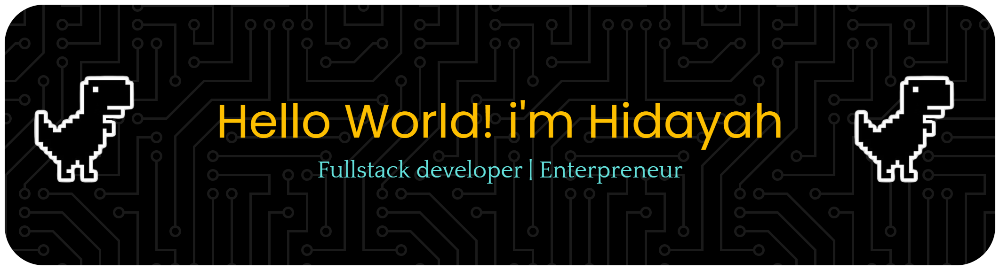
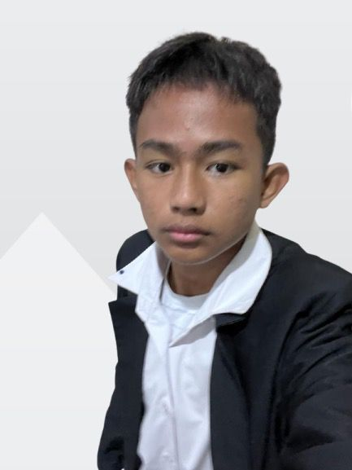

<!-- Hidayah Muhammad Fadillah GitHub Profile README -->

<!-- HEADER -->

  

<!-- PROFILE SECTION -->

  
  
  <!-- Typing effect title (warna oranye) -->
  <h1 align="center">
    
  </h1>

  
Creating digital experiences that blend functionality, design, and impact.

---

### About Me
I'm a Developer who loves building seamless, scalable, and efficient web solutions.  
I specialize in crafting modern user interfaces and developing robust APIs that deliver excellent user experiences.

I love learning new things, trying new challenges, and exploring technology that pushes the boundaries of creativity and logic.  

---

### Skills & Tools

### ⚙️ Skills & Tools

<!-- 1 -->

  
  
  
  
  

<!-- 2 -->

  
  
  
  
  

<!-- 3 -->

  
  
  
  
  

<!-- 4 -->

  
  
  
  
  

<!-- 5 -->

  
  
  
  
  

<!-- 6 -->

  
  

---

### Entrepreneur Experience

#### [PadelStoreID (Itemku)](https://itemku.com/toko/padelstoreid/12026056)

  

*March 21, 2024 – Present*  
**Revenue:** ~$2,000  

A digital game store selling rare in-game items, game passes, and tokens for popular games.

**Key Skills:**  
Digital Marketing • Customer Support • Online Sales Strategy • Inventory Management • Business Analytics • Social Media Marketing • Profit & Cost Calculation • Product Sourcing

---

#### [PadelStoreID (ZeusX)](https://zeusx.com/seller/padelstoreid-572107)

  

*November 8, 2024 – Present*  
**Revenue:** ~$10,000  

An international marketplace for buying and selling game accounts and digital assets safely and reliably.

**Key Skills:**  
Digital Marketing • Sales Planning • Business Analytics • Payment Handling • Problem Solving • Adaptability • Customer Engagement

---

### GitHub Stats

  
  

---

### Connect with Me

---

  

    “Building useful digital ecosystems for gamers and developers alike.”
  

  
Made with ❤️ by <b>Hidayah Muhammad Fadillah</b>

