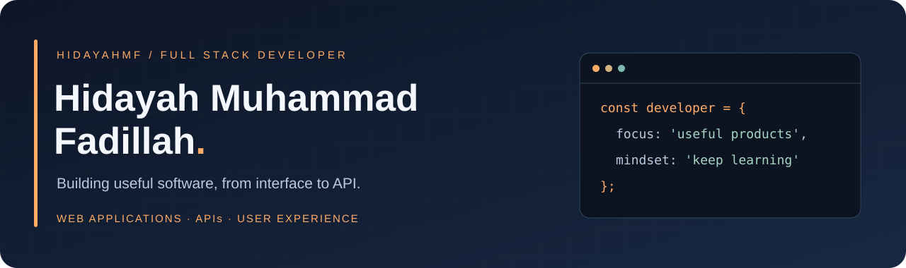

  

  
  
  

## Hey, I'm Hidayah 👋

I build web applications that connect thoughtful interfaces with practical backend systems. My work spans company websites, ordering platforms, and educational experiences.

- **Frontend:** responsive interfaces with React, JavaScript, and TypeScript.
- **Backend:** APIs and data-driven applications with Node.js, Express, and Laravel.
- **Approach:** understand the workflow, build something useful, and keep improving it.

## Selected projects

<table>
<tr>
<td width="50%" valign="top">
<h3>01 · Kantin Pintar</h3>

A canteen ordering application with customer and admin interfaces, menu management, and order workflows.

<code>React</code> <code>Express</code> <code>MongoDB</code>

<a href="https://github.com/HidayahMF/kantinpintarv2"><b>Explore project →</b></a>
</td>
<td width="50%" valign="top">
<h3>02 · BMC Website</h3>

A company website combining a React frontend with an Express backend and authenticated internal features.

<code>React</code> <code>Express</code> <code>MySQL</code>

<a href="https://github.com/HidayahMF/BMC"><b>Explore project →</b></a>
</td>
</tr>
<tr>
<td width="50%" valign="top">
<h3>03 · OutGamble</h3>

An educational web experience raising awareness of online gambling risks through information and prevention content.

<code>React</code> <code>Vite</code> <code>Education</code>

<a href="https://github.com/HidayahMF/OutGamble"><b>Explore project →</b></a>
</td>
<td width="50%" valign="top">
<h3>04 · Portfolio</h3>

A personal portfolio project with a Laravel backend for managing portfolio entries.

<code>PHP</code> <code>Laravel</code> <code>Portfolio</code>

<a href="https://github.com/HidayahMF/Portofolio-2025"><b>Explore project →</b></a>
</td>
</tr>
</table>

## Tech stack

**Frontend**

  

**Backend & databases**

  

**Tools & workflow**

  

More technologies I've explored

 

Next.js · React Native · Python · Leaflet · Axios · JWT · Debian · Arduino · Vercel · Canva

---

  <b>Have an idea worth building?</b> 
  Let's talk about web applications, APIs, and useful digital products.  
  <a href="https://www.linkedin.com/in/hidayah-muhammad-fadillah-89695b384/">Connect on LinkedIn</a>
  &nbsp;·&nbsp;
  <a href="https://github.com/HidayahMF?tab=repositories">Browse my work</a>

## Development documentation

- [Development pipeline](docs/development-pipeline.md) — code-grounded flow, source map, declared commands, validation plan, and current limitations.
