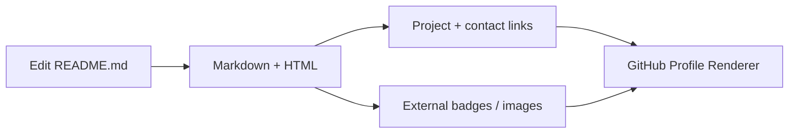
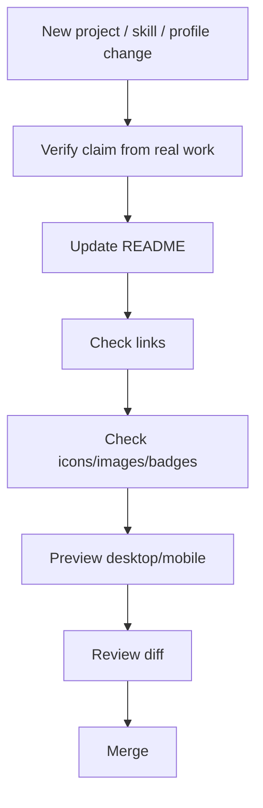
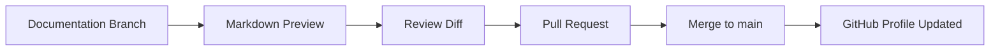
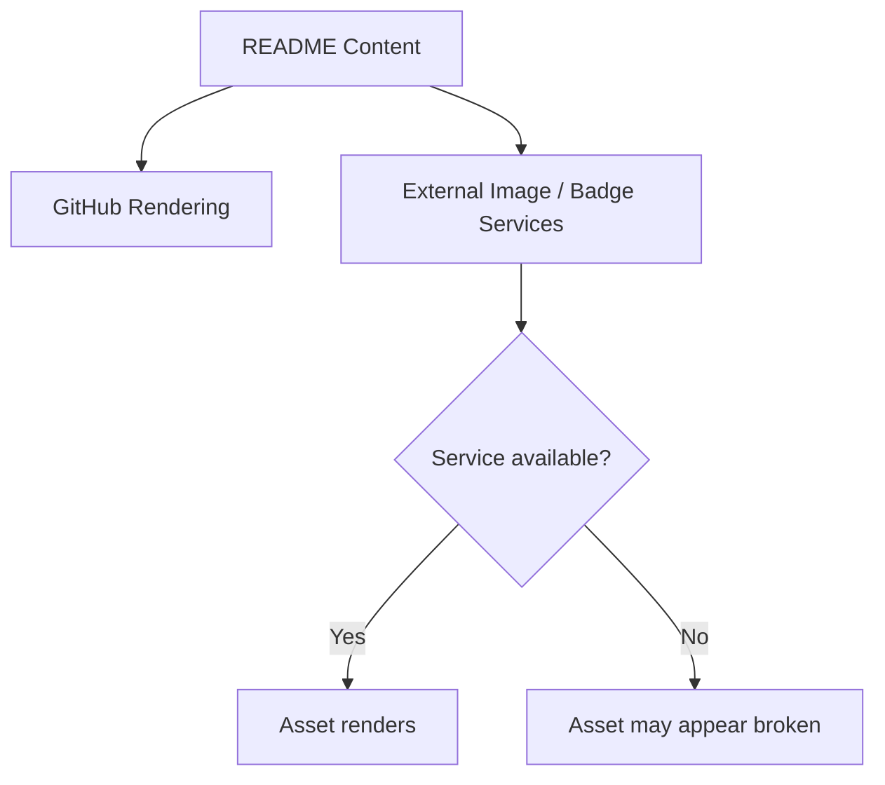

# HidayahMF — Development Pipeline

> Code-grounded maintenance and publishing guide for the GitHub profile repository. Reviewed from `main` at `9ae6037d4170` on 2026-09-17.

This repository is the public GitHub profile itself. The primary product is `README.md`: profile introduction, selected projects, technology icons, badges, and contact links.

## 1. Publishing architecture

## 2. Profile update pipeline

## 3. Content ownership

| Area | Source of truth |
| --- | --- |
| Bio / introduction | `README.md` |
| Featured projects | `README.md` project sections |
| Technology stack | README icons/badges |
| Contact links | README links |
| Rendering | GitHub profile README feature |

## 4. Verification gates

Before publishing:

- Project descriptions match actual repository capabilities.
- Private/internal implementation details are not exposed accidentally.
- Repository links resolve to the intended project.
- Contact links are valid.
- Image/badge URLs render correctly.
- Alt text or readable labels exist where appropriate.
- HTML tables and Markdown render acceptably on desktop and narrow screens.

## 5. Release pipeline

There is no application runtime, package manifest, server, database, or conventional CI requirement in the reviewed snapshot.

## 6. Reliability notes

External media can fail independently even when the README syntax is correct.

## 7. Source map

- [`README.md`](https://github.com/HidayahMF/HidayahMF/blob/9ae6037d4170d41c38acf4ba9d4defe5ea11e7d3/README.md)

Keep this guide synchronized when the profile structure, public project selection, or external media strategy changes.