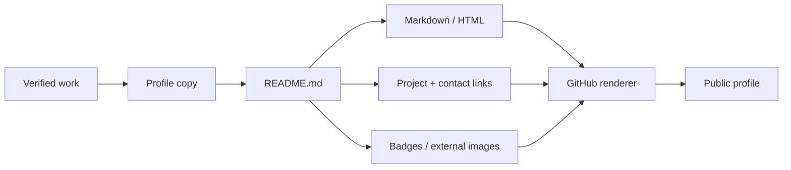
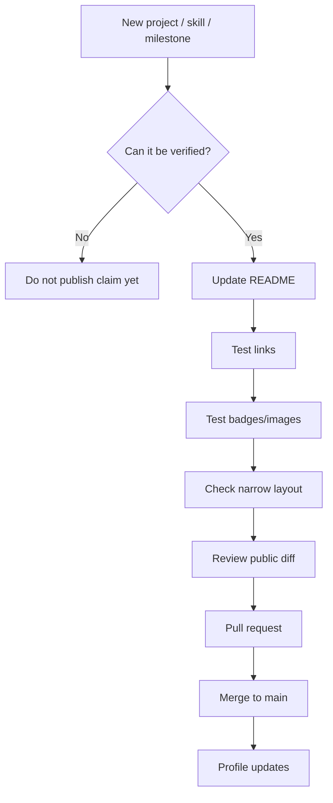
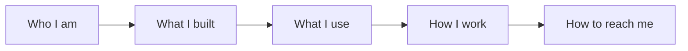
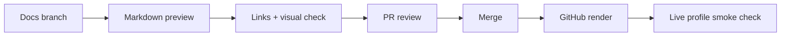
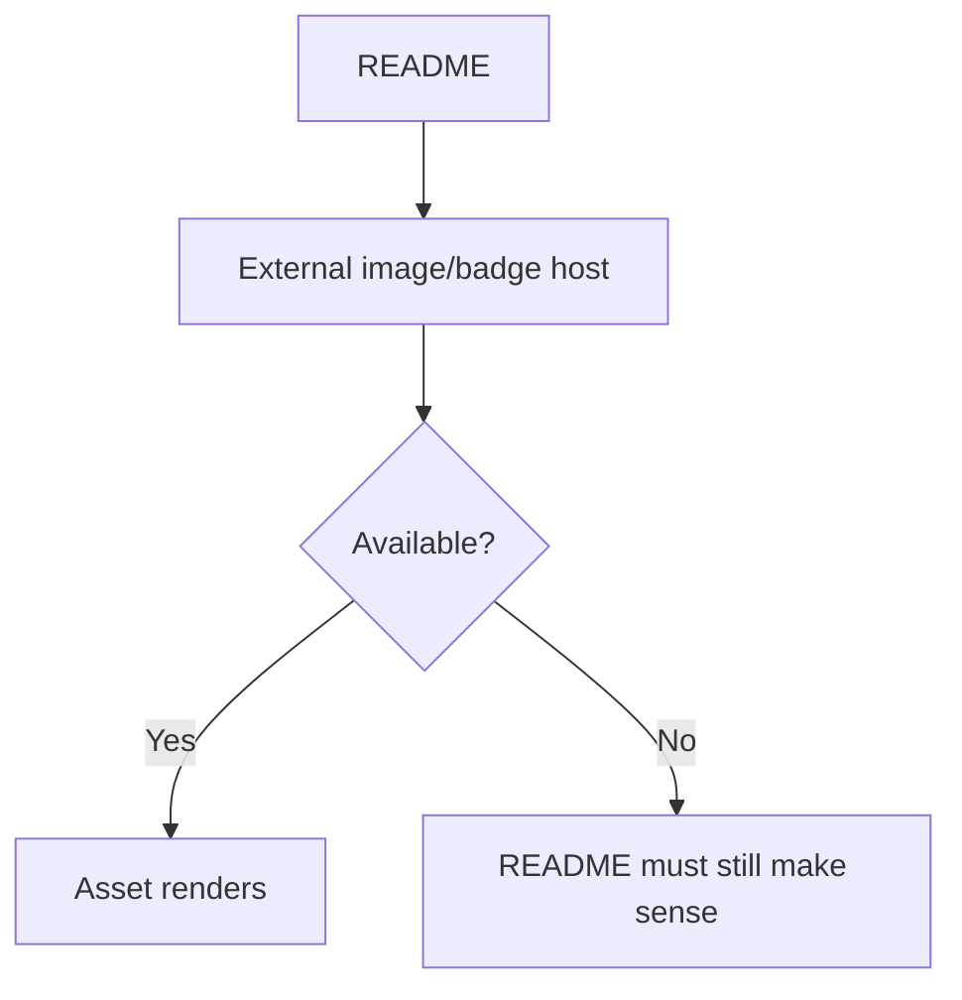

# 🧑‍🚀 HidayahMF — GitHub Profile Publishing Blueprint

> **The repository is the profile.** `README.md` is the product, GitHub is the renderer, and every public claim should stay traceable to real work.

**Reviewed snapshot:** `main` @ [`9ae6037d4170`](https://github.com/HidayahMF/HidayahMF/commit/9ae6037d4170d41c38acf4ba9d4defe5ea11e7d3) — 2026-09-17

## ⚡ Profile system

| Area | Source of truth |
| --- | --- |
| Intro / bio | `README.md` |
| Featured work | README project sections |
| Tech stack | README icons / badges |
| Contact | README links |
| Renderer | GitHub Profile README |
| App runtime | None |

## 🏗️ Publishing architecture

## ✍️ Profile update journey

## 🛡️ Public-profile quality gates

| Gate | Pass condition |
| --- | --- |
| Accuracy | Project descriptions match actual implementation |
| Privacy | No internal/private details leak into public copy |
| Navigation | Every featured repository link resolves correctly |
| Contact | Public contact destinations are intentional and valid |
| Rendering | Markdown/HTML tables render cleanly |
| Media | Icons/badges load or degrade acceptably |
| Mobile | Profile remains readable on narrow screens |

## 🎯 Content hierarchy

A strong profile should move from **identity → evidence → skills → engineering depth → contact**, rather than becoming a wall of badges.

## 🗺️ Source map

| File | Responsibility |
| --- | --- |
| [`README.md`](https://github.com/HidayahMF/HidayahMF/blob/9ae6037d4170d41c38acf4ba9d4defe5ea11e7d3/README.md) | Entire rendered GitHub profile |

## 🚀 Publishing pipeline

No application runtime, database, build system, or conventional CI requirement exists in the reviewed snapshot.

## ⚠️ Risk radar

| Priority | Risk | Guardrail |
| --- | --- | --- |
| 🟠 Medium | Profile claims drift from real repositories | Re-verify project copy when repos change |
| 🟠 Medium | Internal/private details become public | Review README diffs as publication changes |
| 🟡 Low | External badge/image services fail | Keep critical information readable without them |
| 🟡 Low | Badge overload hides strongest work | Prioritize projects and engineering evidence |

## 🖼️ External media reliability

## 📌 Definition of a strong update

A good profile change should improve at least one of these: **clarity, evidence, navigation, credibility, or visual hierarchy**. Adding another badge without improving those is usually not a meaningful release.

---

### Keeping this blueprint accurate

Update this document when the profile layout, featured-project strategy, or external media approach changes.
